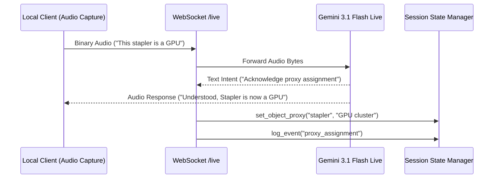
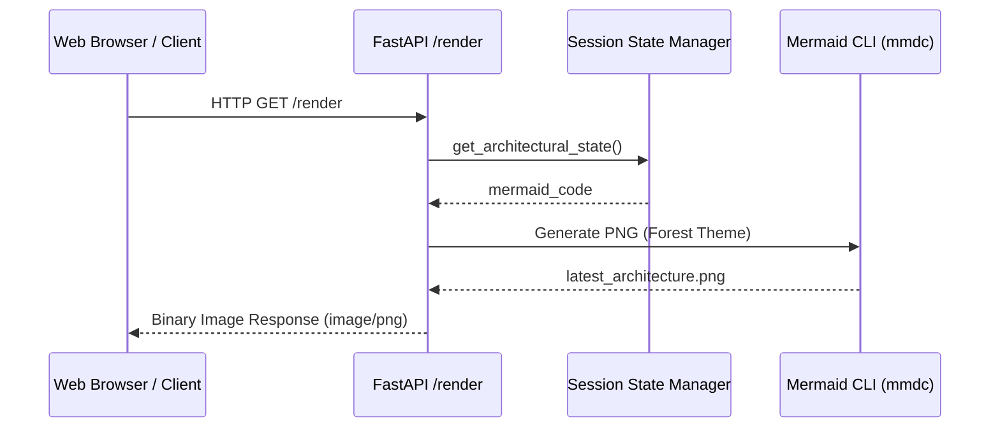

# Multimodal Workflows: FUSE

## 1. Vision Extraction Pipeline (VisionStateCapture)
This workflow handles the transformation of a physical technical sketch into Mermaid.js code.

```mermaid
sequenceDiagram
    participant Client as Local Client Streamer
    participant Server as FastAPI (Cloud Run)
    participant Gemini as Gemini 3.1 Flash Lite
    participant Redis as Session State Manager

    Client->>Server: HTTP POST /vision/frame (Binary JPEG)
    Server->>Gemini: Analyze Frame (Prompt: Extract Mermaid)
    Gemini-->>Server: "graph TD; A-->B"
    Server->>Redis: update_architectural_state(mermaid_code)
    Server->>Redis: log_event("vision_update")
    Server-->>Client: 200 OK (Success, Mermaid Length)
```

## 2. "Imagine" Mode: Proxy Object Registry (Live Stream)
This workflow handles real-time voice-to-state object assignments.



## 3. On-Demand Rendering Workflow
This workflow converts the persisted state into a high-fidelity visual output.


