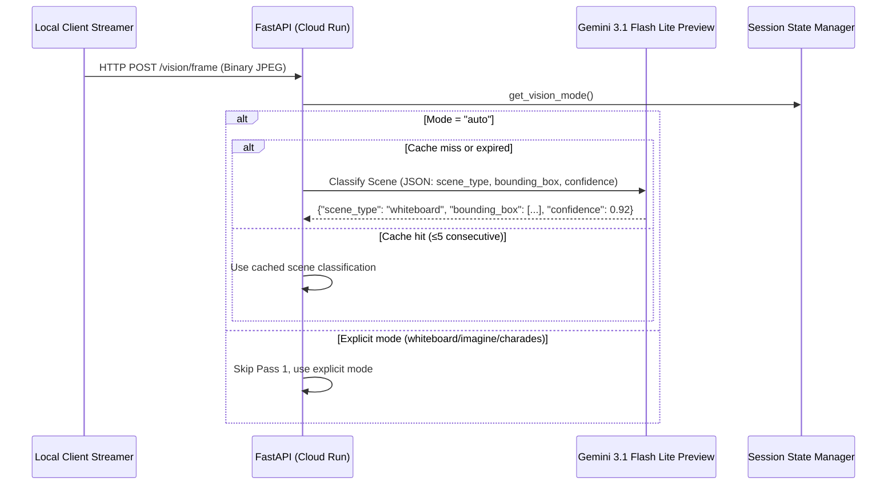
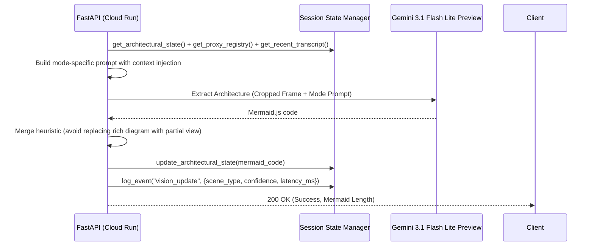
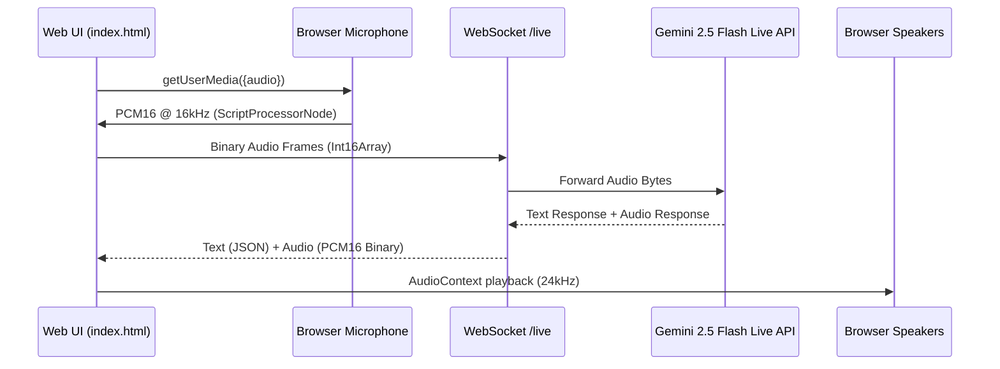
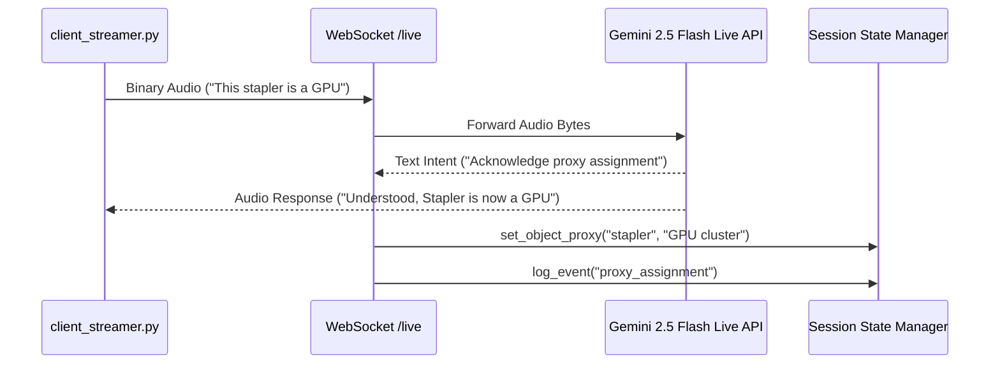
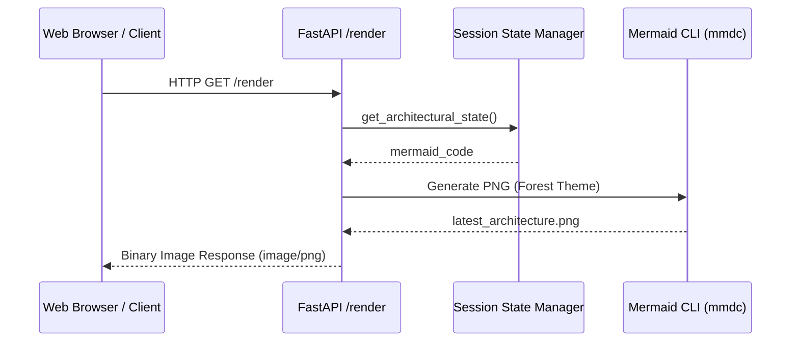
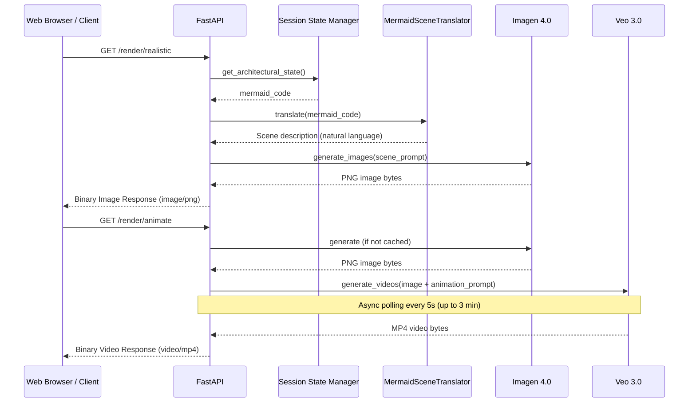

# Multimodal Workflows: FUSE

## 1. Vision Extraction Pipeline (VisionStateCapture) — Two-Pass

This workflow handles the transformation of a physical scene into Mermaid.js code using a two-pass pipeline with scene classification, ROI cropping, and mode-specific extraction.

### Pass 1: Scene Classification

### ROI Cropping
If Pass 1 returns a bounding box with confidence ≥ 0.6, the frame is cropped to the region of interest using OpenCV before Pass 2.

- **Bounding box format**: `[ymin, xmin, ymax, xmax]` normalized 0-1000 (Gemini standard)
- **Descale**: `pixel_coord = int(normalized * image_dim / 1000)`
- **Fallback**: If confidence is below threshold or crop fails, the full frame is used

### Pass 2: Mode-Specific Extraction

### Mode-Specific Prompts

| Mode | Trigger | Context Injected | Prompt Focus |
|------|---------|-----------------|--------------|
| **Whiteboard** | scene_type=`whiteboard` or mode=`whiteboard` | Current Mermaid state | Isolate writing surface, extract boxes/arrows/labels |
| **Imagine** | scene_type=`objects` or mode=`imagine` | Proxy registry + Current Mermaid state | Identify assigned objects, map spatial arrangement to architecture |
| **Charades** | scene_type=`gesture` or mode=`charades` | Recent transcript + Current Mermaid state | Interpret hand gestures, cross-reference with voice context |
| **Fallback** | scene_type=`mixed`/`unclear` | Current Mermaid state | Generic architecture extraction |

### Frame Debouncing
The `/vision/frame` endpoint implements frame-level debouncing: if a frame arrives while a previous frame is still being processed, it is dropped with `{"status": "skipped"}`. This prevents processing backlog during continuous streaming.

## 2. "Imagine" Mode: Proxy Object Registry (Live Stream)
This workflow handles real-time voice-to-state object assignments. Voice input is supported from both the **Web UI** (browser microphone via Web Audio API) and the **Python client** (`client_streamer.py` via PyAudio).

### Browser Voice Flow

### Python Client Voice Flow

## 3. Vision Mode Switching

Users can switch vision modes via three mechanisms:

| Method | Endpoint / Mechanism | Example |
|--------|---------------------|---------|
| **UI Dropdown** | `POST /vision/mode` | Select "Whiteboard" from dropdown in camera panel |
| **Text Command** | `POST /command` | Type "whiteboard mode" or "switch to imagine mode" |
| **Frame Override** | `POST /vision/frame?mode=whiteboard` | Query parameter on frame submission |

Supported modes: `auto`, `whiteboard`, `imagine`, `charades`

## 4. Transcript Logging for Context Injection

Both user text messages and model text responses are logged as `voice_input` events in Redis during the WebSocket session. These events are retrieved by `get_recent_transcript()` and injected into the Charades mode prompt for gesture-voice cross-referencing.

## 5. On-Demand Rendering Workflow
This workflow converts the persisted state into a high-fidelity visual output.

## 6. Photorealistic Visualization Pipeline (Imagen + Veo 3)

This workflow transforms Mermaid diagrams into photorealistic images and animated videos.

### Scene Translation Pipeline

The `MermaidSceneTranslator` converts Mermaid syntax into visual scene descriptions:

1. **Parse nodes**: Extract node IDs and labels using regex patterns
2. **Parse edges**: Extract connections with edge types (-->, ---, -.->)
3. **Parse subgraphs**: Extract zone groupings
4. **Map to visuals**: Match each node label against a visual metaphor dictionary (70+ mappings)
5. **Build scene**: Compose a natural-language description of the entire infrastructure

### Caching

| Layer | TTL | Key |
|-------|-----|-----|
| Imagen in-memory | 5 min | SHA-256 of Mermaid code |
| Veo 3 in-memory | 10 min | SHA-256 of image bytes |
| Disk persistence | Until cleanup | `output/visualizations/`, `output/animations/` |
