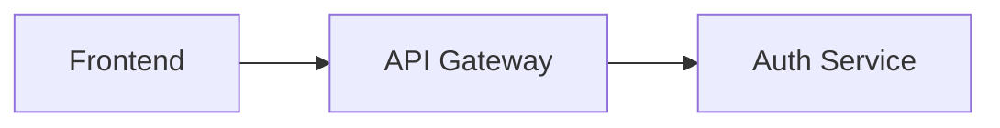

# State Management: FUSE

## 1. Persistence Layer
FUSE uses **Google Cloud Memory Store (Redis)** for low-latency session tracking. All architectural state and multimodal intent must be persisted to Redis to ensure consistency between the `VisionStateCapture` (HTTP) and `GeminiLiveStreamHandler` (WebSocket) components.

## 2. Redis Schema (Session ID: `fuse-session-latest`)

| Key | Type | Description |
| :--- | :--- | :--- |
| `latest:architectural_state` | `String` | The current valid Mermaid.js code for the system design. |
| `latest:proxy_registry` | `Hash` | Map of physical object names to their technical roles (e.g., `stapler` -> `GPU cluster`). |
| `latest:events` | `List` | A chronological log of session events (JSON) for historical context and transcript retrieval. |
| `latest:vision_mode` | `String` | Current vision processing mode: `auto` (default), `whiteboard`, `imagine`, or `charades`. |

## 3. Data Formats

### 3.1 Architectural State (Mermaid.js)
Stored as a raw string. Example:


### 3.2 Proxy Registry
Stored as a Redis Hash.
*   **Field**: `object_id` (e.g., `coffee_mug`)
*   **Value**: `technical_role` (e.g., `database_cluster`)

Read by `get_proxy_registry()` and injected into the Imagine mode vision prompt.

### 3.3 Vision Mode
Stored as a Redis String. Valid values:
- `auto` — Pass 1 scene classification determines the prompt (default)
- `whiteboard` — Force whiteboard extraction prompt
- `imagine` — Force proxy object recognition prompt
- `charades` — Force gesture interpretation prompt

Set via `POST /vision/mode`, `POST /command` (text commands like "whiteboard mode"), or `POST /vision/frame?mode=whiteboard`.

### 3.4 Event Log (JSON)
Each entry follows this structure:
```json
{
  "type": "vision_update | proxy_assignment | voice_input | mode_switch | validation_error",
  "timestamp": "ISO-8601",
  "payload": {
    "mermaid_length": 450,
    "object": "stapler",
    "role": "GPU",
    "text": "user or model transcript",
    "mode": "whiteboard",
    "scene_type": "whiteboard",
    "confidence": 0.92,
    "latency_ms": 1200
  }
}
```

Event types:
- `vision_update` — Frame processed, includes scene_type, confidence, latency
- `proxy_assignment` — Physical object mapped to technical role
- `voice_input` — User text or model text response (used for Charades transcript injection)
- `mode_switch` — Vision mode changed via command
- `validation` — Periodic or on-demand architecture validation result
- `connection_error` — WebSocket/Gemini connection failure with stage, error_type, and detail
- `imagen_generation` — Imagen visualization event
- `veo3_generation` — Veo3 animation event

## 4. State Lifecycle
1.  **Initialization**: The `SessionStateManager` clears or initializes the session on server startup.
2.  **Updates**: Components push state changes independently.
3.  **Context Injection**: The vision pipeline reads proxy registry, current Mermaid state, and recent transcript events before building mode-specific prompts.
4.  **Read-Back**: The `ProofOrchestrator` and `DiagramRenderer` perform atomic reads to ensure they are working with the latest validated model.

## 5. Data Flow: Vision Context Injection

```
Redis                          VisionStateCapture
├── proxy_registry ──────────► IMAGINE_PROMPT (Pass 2)
├── architectural_state ─────► build_context_block() (all modes)
├── events (voice_input) ───► CHARADES_PROMPT (Pass 2)
└── vision_mode ─────────────► Mode selection (Pass 1 skip or auto)
```

## 6. Session Diagnostics

The `get_session_diagnostics()` method aggregates session state for the UAT observability UI:

```python
{
    "vision_mode": "auto",
    "proxy_count": 3,
    "proxy_registry": {"stapler": "GPU cluster", ...},
    "diagram_length": 450,
    "total_events": 12,
    "recent_errors": [{"type": "connection_error", ...}],
    "last_event": {...}
}
```

This is consumed by the `/health` endpoint and the client-side System Status panel.
