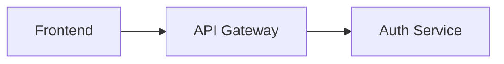

# State Management: FUSE

## 1. Persistence Layer
FUSE uses **Google Cloud Memory Store (Redis)** for low-latency session tracking. All architectural state and multimodal intent must be persisted to Redis to ensure consistency between the `VisionStateCapture` (HTTP) and `GeminiLiveStreamHandler` (WebSocket) components.

## 2. Redis Schema (Session ID: `fuse-session-latest`)

| Key | Type | Description |
| :--- | :--- | :--- |
| `latest:architectural_state` | `String` | The current valid Mermaid.js code for the system design. |
| `latest:proxy_registry` | `Hash` | Map of physical object names to their technical roles (e.g., `stapler` -> `GPU cluster`). |
| `latest:events` | `List` | A chronological log of session events (JSON) for historical context. |

## 3. Data Formats

### 3.1 Architectural State (Mermaid.js)
Stored as a raw string. Example:


### 3.2 Proxy Registry
Stored as a Redis Hash.
*   **Field**: `object_id` (e.g., `coffee_mug`)
*   **Value**: `technical_role` (e.g., `database_cluster`)

### 3.3 Event Log (JSON)
Each entry follows this structure:
```json
{
  "type": "vision_update | proxy_assignment | validation_error",
  "timestamp": "ISO-8601",
  "payload": {
    "mermaid_length": 450,
    "object": "stapler",
    "role": "GPU"
  }
}
```

## 4. State Lifecycle
1.  **Initialization**: The `SessionStateManager` clears or initializes the session on server startup.
2.  **Updates**: Components push state changes independently.
3.  **Read-Back**: The `ProofOrchestrator` and `DiagramRenderer` perform atomic reads to ensure they are working with the latest validated model.
