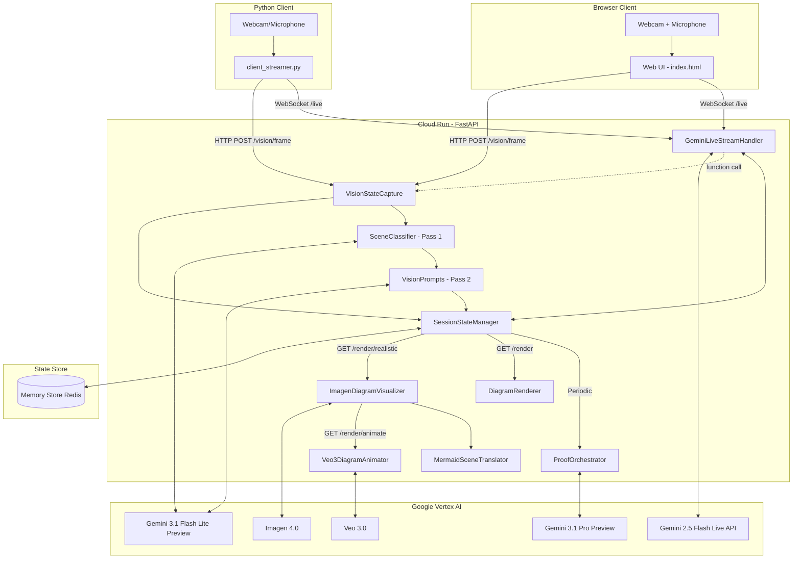

# System Overview: FUSE (Collaborative Brainstorming Intelligence)

## 1. Core Architecture Pattern
FUSE uses a **Client-Server Multimodal Streaming** pattern. It separates physical media capture (client-side) from high-stakes technical reasoning and state management (server-side/GCP).



## 2. Component Roles

| Component | Responsibility | Model / Tool |
| :--- | :--- | :--- |
| **VisionStateCapture** | Two-pass vision pipeline: scene classification, ROI cropping, and mode-specific extraction. | `gemini-3.1-flash-lite-preview` |
| **SceneClassifier** | Pass 1: Classifies scene type (whiteboard/objects/gesture/mixed/unclear) and returns bounding box ROI. | `gemini-3.1-flash-lite-preview` |
| **VisionPrompts** | Pass 2: Mode-specific prompt templates with context injection (proxy registry, transcript, current diagram state). | Prompt templates |
| **GeminiLiveStreamHandler** | Bidirectional audio streaming with function calling. Handles proxy assignments, vision mode switching, and on-demand vision capture via tool use. Session resumption + context compression for stability. | `gemini-live-2.5-flash-native-audio` |
| **ProofOrchestrator** | High-fidelity architectural reasoning and validation. | `gemini-3.1-pro-preview` |
| **SessionStateManager** | Low-latency state persistence, event logging, vision mode, proxy registry, transcript retrieval, and session diagnostics aggregation. | Google Cloud Memory Store (Redis) |
| **DiagramRenderer** | Automated PNG generation for session output. | Mermaid CLI (`mmdc`) |
| **ImagenDiagramVisualizer** | Generates photorealistic images from Mermaid diagrams via scene description translation. | `imagen-4.0-generate-001` |
| **MermaidSceneTranslator** | Parses Mermaid AST and converts nodes/edges into natural-language visual scene descriptions. | Prompt templates |
| **Veo3DiagramAnimator** | Animates photorealistic architecture images into short walkthrough videos. | `veo-3.0-generate-preview` |

## 3. Vision Pipeline Detail

The vision system uses a **two-pass architecture** to focus on relevant content:

1. **Pass 1 (Scene Classification)**: A lightweight Gemini call classifies the scene and returns a bounding box for the region of interest. Results are cached for up to 5 consecutive frames to reduce API calls.

2. **ROI Cropping**: If a bounding box is returned with confidence >= 0.6, the frame is cropped to that region using OpenCV before Pass 2.

3. **Pass 2 (Mode-Specific Extraction)**: A tailored prompt is built based on the detected scene type (or explicit user mode), injecting relevant context:
   - **Whiteboard**: Isolates the writing surface, ignores people/background
   - **Imagine**: Injects proxy registry from Redis so the model knows which physical objects represent which components
   - **Charades**: Injects recent transcript for gesture-voice cross-referencing
   - **Fallback**: Generic architecture extraction

4. **Merge Heuristic**: New Mermaid output is compared against the existing diagram. If the new output has significantly fewer edges (< 50%), the existing diagram is preserved to prevent partial views from overwriting a complete design.

## 4. Client Options

| Client | Voice Input | Vision Input | Use Case |
| :--- | :--- | :--- | :--- |
| **Web UI** (`index.html`) | Browser microphone (Web Audio API, PCM16 @ 16kHz) | Browser webcam (getUserMedia) | Primary interface for brainstorming sessions |
| **Python Client** (`client_streamer.py`) | PyAudio microphone capture | OpenCV webcam capture | Headless / CLI environments |

## 5. Communication Protocols
*   **WebSockets (`/live`)**: Handles bidirectional binary audio (PCM16) between clients and the Gemini Live API session. Supports function calling for on-demand vision capture (`capture_and_analyze_frame`), session context retrieval (`get_session_context`), and proxy registration (`set_proxy_object`). Includes automatic session resumption and reconnect loop (issue #18). All tool calls are logged to Redis for audit trail (issue #19).
*   **REST API (`/vision/frame`)**: Ingests JPEG frames for two-pass vision analysis. Supports `?mode=` query parameter override. Implements frame debouncing.
*   **REST API (`/vision/mode`)**: GET returns current vision mode; POST sets it (`auto`, `whiteboard`, `imagine`, `charades`).
*   **REST API (`/state/mermaid`)**: Returns the current Mermaid.js architectural state from Redis.
*   **REST API (`/validate`)**: Triggers on-demand architecture validation via ProofOrchestrator.
*   **REST API (`/command`)**: Accepts text commands for proxy assignment and vision mode switching.
*   **REST API (`/render/realistic`)**: Generates a photorealistic image from the current Mermaid state using Imagen 4.0. Returns PNG bytes.
*   **REST API (`/render/animate`)**: Generates an animated walkthrough video from the realistic image using Veo 3.0. Returns MP4 bytes.
*   **REST API (`/render/visualize`)**: Full pipeline (Mermaid -> image -> video). Returns JSON with base64-encoded image and video.
*   **REST API (`/health`)**: Deep health check returning component-level status (Redis ping with latency, all handler initialization checks), session diagnostics summary, and recent connection errors. Returns `"ok"` or `"degraded"` overall status.

## 6. Live API Function Calling (Issue #19)

The Gemini Live session supports function calling (tool use), enabling the audio model to trigger server-side actions on demand. When the user asks Gemini to "look at the whiteboard" or "describe what's on the table", Gemini calls a registered function instead of guessing.

### Registered Tools

| Function | Purpose | When Gemini Calls It |
| :--- | :--- | :--- |
| `capture_and_analyze_frame` | Runs the latest camera frame through the two-pass REST vision pipeline | User asks to see/describe/analyze something |
| `get_session_context` | Returns proxy registry, current Mermaid diagram, recent transcript, vision mode | User asks about current state or assignments |
| `set_proxy_object` | Registers a physical object as an architecture component | User assigns a role to an object |

### Flow
```
User speaks → Gemini decides to call function → response.tool_call fires
→ Server executes function (e.g., vision capture) → logs to Redis
→ Server sends result via session.send_tool_response()
→ Gemini speaks the result to the user via audio
```

### Audit Trail
All function calls and responses are logged to Redis via `state_manager.log_event()`:
- `tool_call`: function name, arguments, call_id, timestamp
- `tool_response`: function name, call_id, status, latency_ms
- Client receives `tool_activity` WebSocket messages shown in the connection log

## 7. Live API Session Management (Issue #18)

The `/live` WebSocket handler includes session resilience features:

- **Session Resumption**: `SessionResumptionConfig` captures resumption handles from each response. If the Gemini server resets the connection, the handler reconnects with the saved handle (valid for 2 hours).
- **Context Window Compression**: `SlidingWindow` compression prevents the 128k token limit from being reached, removing the ~15-minute session cap.
- **Reconnect Loop**: When `session.receive()` ends or GoAway fires, the handler reconnects transparently (up to 10 retries) while keeping the client WebSocket open.
- **GoAway Handling**: Detects server shutdown warnings and triggers proactive reconnect.

## 8. UAT Observability

FUSE includes a lightweight observability layer for user acceptance testing and demo debugging:

- **Deep Health Check** (`/health`): Verifies Redis connectivity (with latency), all 6 component initializations, and session state summary including recent error events.
- **Structured WebSocket Messages**: The `/live` endpoint sends `{"type": "status", "stage": "..."}` and `{"type": "error", "stage": "...", "error_type": "...", "detail": "..."}` messages at each connection stage (initialization → connecting → connected). Errors are logged as `connection_error` events in Redis.
- **System Status Panel**: A collapsible UI panel (header gear icon) showing component health with green/red indicators, session metrics (vision mode, proxy count, diagram length), and a timestamped connection log with color-coded entries.
- **WebSocket Close Diagnostics**: Close codes (1000, 1006, 1011, etc.) are parsed into human-readable descriptions and displayed in both the chat and connection log.
