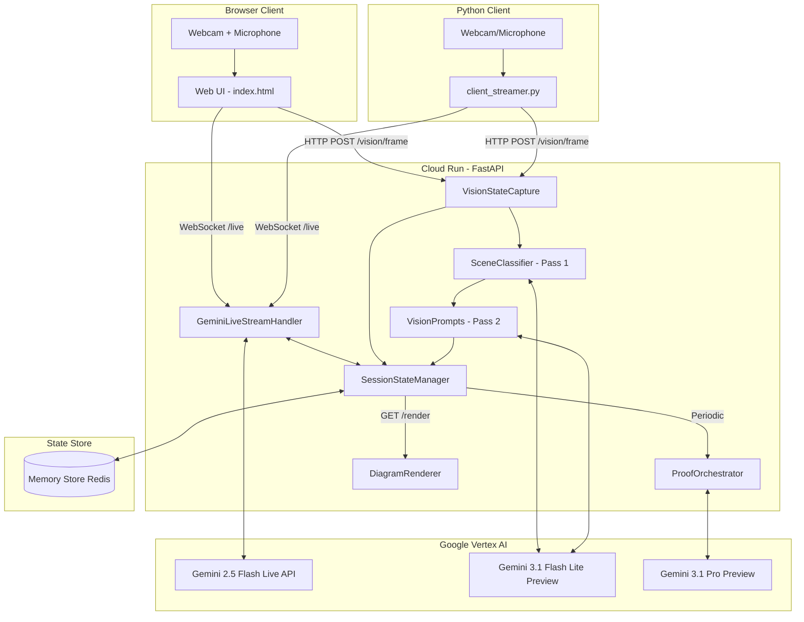

# System Overview: FUSE (Collaborative Brainstorming Intelligence)

## 1. Core Architecture Pattern
FUSE uses a **Client-Server Multimodal Streaming** pattern. It separates physical media capture (client-side) from high-stakes technical reasoning and state management (server-side/GCP).

## 2. Component Roles

| Component | Responsibility | Model / Tool |
| :--- | :--- | :--- |
| **VisionStateCapture** | Two-pass vision pipeline: scene classification, ROI cropping, and mode-specific extraction. | `gemini-3.1-flash-lite-preview` |
| **SceneClassifier** | Pass 1: Classifies scene type (whiteboard/objects/gesture/mixed/unclear) and returns bounding box ROI. | `gemini-3.1-flash-lite-preview` |
| **VisionPrompts** | Pass 2: Mode-specific prompt templates with context injection (proxy registry, transcript, current diagram state). | Prompt templates |
| **GeminiLiveStreamHandler** | Bidirectional multimodal intent (Voice/Gestures). Handles proxy assignments and vision mode switching. | `gemini-live-2.5-flash-native-audio` |
| **ProofOrchestrator** | High-fidelity architectural reasoning and validation. | `gemini-3.1-pro-preview` |
| **SessionStateManager** | Low-latency state persistence, event logging, vision mode, proxy registry, and transcript retrieval. | Google Cloud Memory Store (Redis) |
| **DiagramRenderer** | Automated PNG generation for session output. | Mermaid CLI (`mmdc`) |

## 3. Vision Pipeline Detail

The vision system uses a **two-pass architecture** to focus on relevant content:

1. **Pass 1 (Scene Classification)**: A lightweight Gemini call classifies the scene and returns a bounding box for the region of interest. Results are cached for up to 5 consecutive frames to reduce API calls.

2. **ROI Cropping**: If a bounding box is returned with confidence >= 0.6, the frame is cropped to that region using OpenCV before Pass 2.

3. **Pass 2 (Mode-Specific Extraction)**: A tailored prompt is built based on the detected scene type (or explicit user mode), injecting relevant context:
   - **Whiteboard**: Isolates the writing surface, ignores people/background
   - **Imagine**: Injects proxy registry from Redis so the model knows which physical objects represent which components
   - **Charades**: Injects recent transcript for gesture-voice cross-referencing
   - **Fallback**: Generic architecture extraction

4. **Merge Heuristic**: New Mermaid output is compared against the existing diagram. If the new output has significantly fewer edges (< 50%), the existing diagram is preserved to prevent partial views from overwriting a complete design.

## 4. Client Options

| Client | Voice Input | Vision Input | Use Case |
| :--- | :--- | :--- | :--- |
| **Web UI** (`index.html`) | Browser microphone (Web Audio API, PCM16 @ 16kHz) | Browser webcam (getUserMedia) | Primary interface for brainstorming sessions |
| **Python Client** (`client_streamer.py`) | PyAudio microphone capture | OpenCV webcam capture | Headless / CLI environments |

## 5. Communication Protocols
*   **WebSockets (`/live`)**: Handles bidirectional binary audio (PCM16) and vision frames between clients and the Gemini Live API session. User text and model responses are logged for vision context injection.
*   **REST API (`/vision/frame`)**: Ingests JPEG frames for two-pass vision analysis. Supports `?mode=` query parameter override. Implements frame debouncing.
*   **REST API (`/vision/mode`)**: GET returns current vision mode; POST sets it (`auto`, `whiteboard`, `imagine`, `charades`).
*   **REST API (`/state/mermaid`)**: Returns the current Mermaid.js architectural state from Redis.
*   **REST API (`/validate`)**: Triggers on-demand architecture validation via ProofOrchestrator.
*   **REST API (`/command`)**: Accepts text commands for proxy assignment and vision mode switching.
