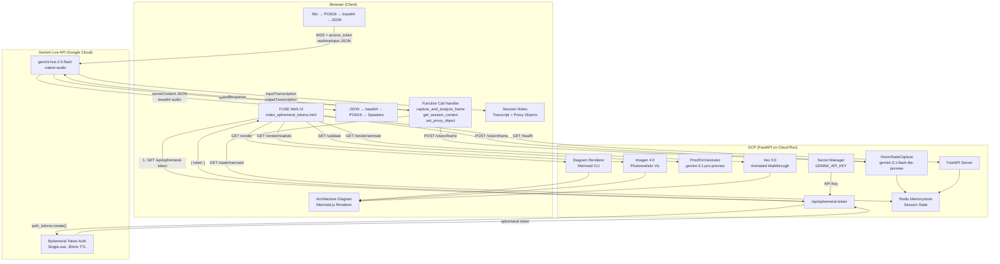
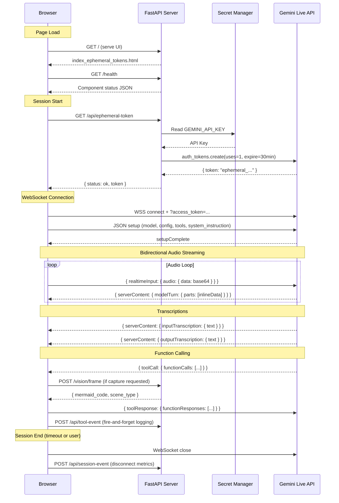
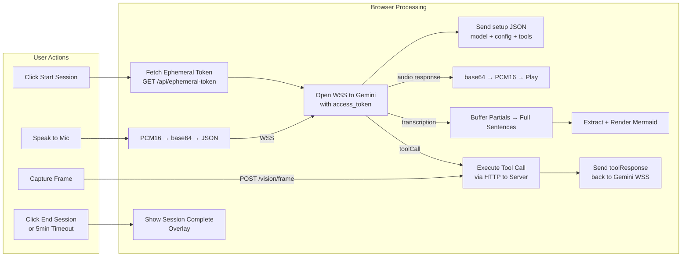

# Ephemeral Token Architecture — Mermaid Diagrams

**Issue**: #38
**Generated from**: `ARCHITECTURE.md`

---

## Full System Architecture

---

## Session Lifecycle Flow

---

## Client-Side Action Flow

---

## GCP Action Flow

```mermaid
graph TD
    subgraph CloudRun["Cloud Run — FastAPI"]
        PageRoute["GET / → Serve UI"]
        HealthRoute["GET /health → Ping All Components"]
        TokenRoute["GET /api/ephemeral-token"]
        VisionRoute["POST /vision/frame"]
        ValidateRoute["GET /validate"]
        RenderRoute["GET /render"]
        RealisticRoute["GET /render/realistic"]
        AnimateRoute["GET /render/animate"]
        EventRoutes["POST /api/session-event<br/>POST /api/tool-event"]
    end

    subgraph GeminiModels["Gemini AI Models"]
        FlashLite["gemini-3.1-flash-lite-preview<br/>Vision + Scene Classification"]
        Pro["gemini-3.1-pro-preview<br/>Architecture Validation"]
        LiveAudio["gemini-live-2.5-flash-native-audio<br/>Conversational AI"]
    end

    subgraph MediaModels["Media Generation"]
        Imagen["imagen-4.0-generate-001<br/>Photorealistic Images"]
        Veo3["veo-3.0-generate-preview<br/>Animated Video"]
    end

    subgraph Storage["Persistence"]
        RedisStore["Redis Memorystore<br/>10.8.239.3:6379<br/>Session State + Events"]
        SecretMgr2["Secret Manager<br/>GEMINI_API_KEY"]
        CloudLogging["Cloud Logging<br/>Structured Events"]
    end

    TokenRoute -->|"API Key"| SecretMgr2
    TokenRoute -->|"auth_tokens.create()"| LiveAudio
    VisionRoute --> FlashLite
    VisionRoute --> RedisStore
    ValidateRoute --> Pro
    RealisticRoute --> Imagen
    AnimateRoute --> Veo3
    HealthRoute --> RedisStore
    HealthRoute --> FlashLite
    HealthRoute --> Pro
    HealthRoute --> Imagen
    HealthRoute --> Veo3
    EventRoutes --> CloudLogging
```

