# FUSE Standalone Product Roadmap

**Document Version:** 1.0
**Date:** 2026-03-10
**Status:** Draft
**Author:** FUSE Product Team

---

## Table of Contents

1. [Executive Summary](#1-executive-summary)
2. [Current State Assessment](#2-current-state-assessment)
3. [Phase 1: Production Hardening](#3-phase-1-production-hardening-q2-2026)
4. [Phase 2: Multi-User and Collaboration](#4-phase-2-multi-user-and-collaboration-q3-2026)
5. [Phase 3: Enhanced AI Capabilities](#5-phase-3-enhanced-ai-capabilities-q4-2026)
6. [Phase 4: Enterprise Features](#6-phase-4-enterprise-features-q1-q2-2027)
7. [Phase 5: Platform and Ecosystem](#7-phase-5-platform-and-ecosystem-q3-q4-2027)
8. [Monetization Strategy](#8-monetization-strategy)
9. [Technical Debt and Infrastructure](#9-technical-debt-and-infrastructure)
10. [Success Metrics and KPIs](#10-success-metrics-and-kpis)
11. [Risk Assessment](#11-risk-assessment)

---

## 1. Executive Summary

FUSE (Collaborative Brainstorming Intelligence) is a real-time AI-powered brainstorming and architecture design tool that combines voice interaction, whiteboard vision capture, and automated diagram generation into a seamless creative workflow. Users speak ideas aloud, sketch on a physical whiteboard, and FUSE synthesizes both inputs into structured, validated architectural diagrams in real time.

**Product Vision:** FUSE will become the standard tool for teams that need to move from unstructured brainstorming to validated, structured technical designs -- replacing the fragmented workflow of whiteboards, note-taking apps, and manual diagramming tools with a single AI-native experience.

**Core Value Proposition:**
- Capture ideas at the speed of thought via voice and vision -- no typing, no context switching.
- Automatically structure and validate architectural designs against best practices.
- Produce export-ready diagrams (Mermaid, SVG, PDF, PowerPoint) directly from brainstorming sessions.
- Enable real-time multi-user collaboration with shared AI context.

**Target Users:**
- Software architects and engineering teams during design sessions.
- Product managers conducting requirements workshops.
- Consultants building solution architectures with clients.
- Educators and students in technical courses.

### Roadmap Overview

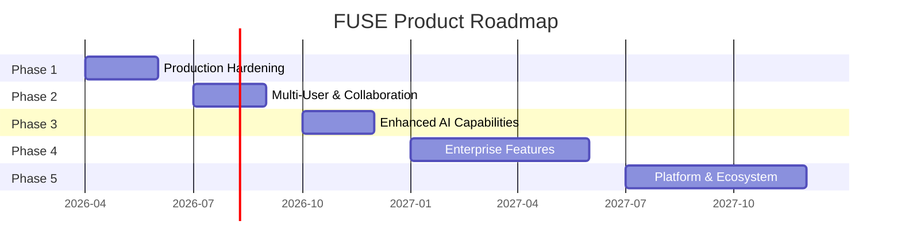

---

## 2. Current State Assessment

### 2.1 What Exists Today

FUSE was built as a hackathon project for the Gemini Live Agent Challenge. It is a functional single-user demo deployed on Google Cloud Run.

**Architecture:**

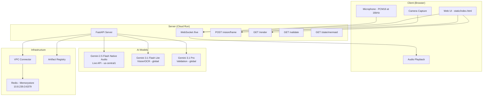

**Current Capabilities:**
- Voice input streamed via WebSocket to Gemini Live API; audio responses played back in browser.
- Camera frames sent to Gemini Flash Lite for whiteboard OCR and content extraction.
- Architectural diagrams generated as Mermaid.js and rendered in the browser.
- Session state stored in Redis.
- Diagram validation using Gemini Pro against architectural best practices.
- Single Cloud Run deployment with VPC connector for Redis access.

### 2.2 Known Limitations

| Category | Limitation |
|---|---|
| **Authentication** | None. The application is publicly accessible with no user identity. |
| **Concurrency** | Single-user only. No concept of rooms, sessions shared between users, or concurrent editing. |
| **Error Handling** | Minimal. Many failure modes (model timeouts, WebSocket drops, Redis connection loss) are unhandled or produce cryptic errors. |
| **Monitoring** | No structured logging, no metrics collection, no alerting. |
| **Scaling** | Single Cloud Run instance. No horizontal scaling strategy, no CDN, no load balancing beyond Cloud Run defaults. |
| **Data Persistence** | Redis only (volatile). No durable storage for session history, diagrams, or user data. |
| **Export** | Mermaid.js rendered in-browser only. No SVG, PDF, or PowerPoint export. |
| **Testing** | No automated tests. No CI/CD pipeline. |
| **Security** | No rate limiting, no input sanitization, no CORS policy, no CSP headers. |

### 2.3 Technical Debt Inventory

1. `client_streamer.py` has uncommitted local modifications with unclear purpose.
2. Hardcoded model names and locations scattered across codebase.
3. No configuration management (environment variables used inconsistently).
4. No database migrations or schema versioning.
5. Static files served directly by FastAPI (no CDN, no caching headers).
6. No health check beyond basic `/health` endpoint (does not verify downstream dependencies).
7. WebSocket connection has no reconnection logic on the client side.
8. No request/response logging or tracing.

---

## 3. Phase 1: Production Hardening (Q2 2026)

**Goal:** Transform the hackathon demo into a reliable, secure, single-user product that can be safely exposed to early adopters.

### 3.1 Authentication and Authorization

| Task | Description | Priority |
|---|---|---|
| OAuth 2.0 / OIDC integration | Support Google Sign-In and GitHub OAuth as initial identity providers. | P0 |
| JWT session management | Issue short-lived JWTs on login; validate on every request and WebSocket connection. | P0 |
| API key support | Allow programmatic access via API keys for future integrations. | P1 |
| CORS and CSP policies | Restrict origins, enforce Content-Security-Policy headers. | P0 |

**Implementation Notes:**
- Use FastAPI's `Depends()` system with a reusable auth dependency.
- Store refresh tokens in Redis with TTL; user profiles in PostgreSQL (introduced in this phase).
- WebSocket authentication: validate JWT in the initial handshake before upgrading the connection.

### 3.2 Error Handling and Resilience

| Task | Description | Priority |
|---|---|---|
| Global exception handlers | Catch and log all unhandled exceptions; return structured error responses. | P0 |
| Retry with exponential backoff | Wrap all Gemini API calls in retry logic (3 retries, jittered backoff). | P0 |
| Circuit breaker pattern | If a model endpoint fails repeatedly, stop calling it temporarily and return a degraded response. | P1 |
| WebSocket reconnection | Client-side auto-reconnect with backoff; server-side session resumption from Redis state. | P0 |
| Graceful degradation | If vision model is down, continue with voice only. If voice model is down, fall back to text input. | P1 |
| Input validation | Validate all incoming payloads (frame sizes, audio format, text length limits). | P0 |

### 3.3 Logging, Monitoring, and Observability

| Task | Description | Priority |
|---|---|---|
| Structured logging | JSON-formatted logs with request IDs, user IDs, and trace correlation. Use Python `structlog`. | P0 |
| Cloud Logging integration | Ship logs to Google Cloud Logging with severity levels. | P0 |
| Cloud Monitoring dashboards | Track request latency, error rates, WebSocket connection counts, model API latency. | P0 |
| Alerting | PagerDuty or Slack alerts for error rate spikes, latency P99 > 5s, Redis connection failures. | P1 |
| OpenTelemetry tracing | Distributed tracing across FastAPI handlers and Gemini API calls. | P2 |

### 3.4 Rate Limiting

| Task | Description | Priority |
|---|---|---|
| Per-user rate limiting | Token bucket algorithm in Redis. Limits: 60 requests/min for REST, 10 WebSocket connections/user. | P0 |
| Per-endpoint limits | Tighter limits on expensive operations (vision frame processing: 2/sec, validation: 10/min). | P1 |
| Global rate limiting | Protect against abuse with global request caps per IP. | P0 |

### 3.5 Configuration Management

| Task | Description | Priority |
|---|---|---|
| Centralized config | Move all configuration to environment variables with a Pydantic `Settings` class. | P0 |
| Model registry | Single source of truth for model names, locations, and fallback models. | P0 |
| Feature flags | Simple feature flag system (Redis-backed) for gradual rollouts. | P2 |

### 3.6 Testing and CI/CD

| Task | Description | Priority |
|---|---|---|
| Unit tests | Minimum 80% coverage on core business logic. Use `pytest` with `pytest-asyncio`. | P0 |
| Integration tests | Test WebSocket flows, vision processing pipeline, and diagram generation end-to-end. | P0 |
| CI pipeline | GitHub Actions: lint (ruff), type check (mypy), test, build Docker image, deploy to staging. | P0 |
| Staging environment | Separate Cloud Run service for pre-production testing. | P0 |
| Load testing | k6 scripts to validate WebSocket concurrency and REST endpoint throughput. | P1 |

### Phase 1 Deliverables

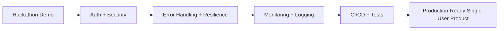

**Exit Criteria:**
- All P0 tasks complete.
- Zero known security vulnerabilities (OWASP Top 10 audit pass).
- Automated test suite runs in CI on every PR.
- Staging and production environments with separate Redis instances.
- Error rate below 1% under normal load.

---

## 4. Phase 2: Multi-User and Collaboration (Q3 2026)

**Goal:** Enable multiple users to brainstorm together in real-time shared sessions.

### 4.1 Room-Based Sessions

| Task | Description | Priority |
|---|---|---|
| Room creation and joining | Users create rooms with unique codes or shareable links. | P0 |
| Room state management | Each room has its own diagram state, conversation history, and AI context in Redis. | P0 |
| Room lifecycle | Auto-expire idle rooms after configurable timeout (default: 24 hours). | P1 |
| Room persistence | Save room snapshots to PostgreSQL for resumption. | P1 |

**Data Model:**

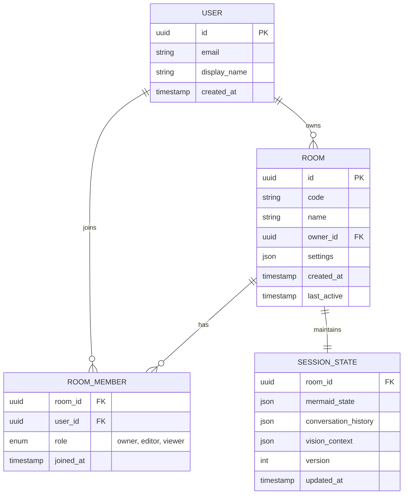

### 4.2 Real-Time Shared State

| Task | Description | Priority |
|---|---|---|
| State broadcast | When any user's input changes the diagram, broadcast the new state to all room members via WebSocket. | P0 |
| Operational Transform (OT) or CRDT | Implement conflict resolution for concurrent diagram edits. Start with last-writer-wins; evolve to OT. | P1 |
| Presence indicators | Show who is in the room, who is speaking, who has camera active. | P0 |
| Cursor/pointer sharing | Show other users' pointer positions on the diagram canvas. | P2 |

### 4.3 User Identity and Profiles

| Task | Description | Priority |
|---|---|---|
| User profiles | Display name, avatar, email. Stored in PostgreSQL. | P0 |
| Session history | Users can see past rooms and revisit saved sessions. | P1 |
| Notification preferences | Email or in-app notifications for room invitations. | P2 |

### 4.4 Role-Based Access Control

| Role | Permissions |
|---|---|
| **Owner** | Full control: edit, invite, remove members, delete room, change settings. |
| **Editor** | Voice input, camera input, diagram editing, export. |
| **Viewer** | Read-only access: see diagram updates and hear audio, but cannot contribute input. |

### 4.5 Scaling for Multi-User

| Task | Description | Priority |
|---|---|---|
| WebSocket fan-out | Use Redis Pub/Sub for broadcasting state changes across multiple Cloud Run instances. | P0 |
| Sticky sessions | Route WebSocket connections to the same instance during a session (Cloud Run session affinity). | P0 |
| Connection pooling | Pool Gemini API connections per room to avoid redundant sessions. | P1 |

### Phase 2 Architecture

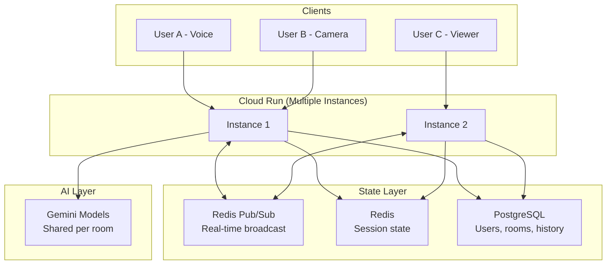

**Exit Criteria:**
- 5 concurrent users per room with sub-500ms state propagation.
- Room creation, joining via link, and role assignment all functional.
- State persists across user disconnections and reconnections.
- No data loss during concurrent edits.

---

## 5. Phase 3: Enhanced AI Capabilities (Q4 2026)

**Goal:** Significantly improve the quality, variety, and utility of AI-generated outputs.

### 5.1 Improved Diagram Generation

| Task | Description | Priority |
|---|---|---|
| Multi-diagram support | Generate and manage multiple diagrams per session (architecture, sequence, class, ER, flowchart). | P0 |
| Incremental updates | AI modifies existing diagrams rather than regenerating from scratch on each input. | P0 |
| Diagram-aware prompting | Fine-tuned prompts that produce cleaner, more consistent Mermaid output. | P0 |
| Layout optimization | Post-processing step to improve diagram readability (node spacing, edge routing). | P1 |
| Natural language diagram editing | "Move the database to the right", "Add a cache between the API and the database". | P1 |

### 5.2 Template Library

| Task | Description | Priority |
|---|---|---|
| Built-in templates | Pre-built starting points: microservices, serverless, data pipeline, ML pipeline, mobile backend. | P0 |
| Template categories | Organized by domain: web, mobile, data, ML, IoT, enterprise. | P1 |
| Custom templates | Users can save their diagrams as reusable templates. | P1 |
| Community templates | Public template gallery (Phase 5 marketplace foundation). | P2 |

### 5.3 Export Formats

| Task | Description | Priority |
|---|---|---|
| SVG export | High-quality vector export of rendered diagrams. | P0 |
| PNG export | Rasterized export at configurable resolution. | P0 |
| PDF export | Multi-page PDF with diagram, annotations, and session transcript. | P1 |
| PowerPoint export | Generate slide decks with diagrams, speaker notes from voice transcript. | P1 |
| Mermaid source export | Raw Mermaid code for use in documentation tools (GitHub, Notion, Confluence). | P0 |
| Draw.io / Lucidchart export | Interoperability with popular diagramming tools. | P2 |

### 5.4 Version History and Undo/Redo

| Task | Description | Priority |
|---|---|---|
| Diagram versioning | Every AI-generated diagram update creates a new version. | P0 |
| Version diff | Visual diff between diagram versions (highlight added/removed/changed nodes and edges). | P1 |
| Undo/redo stack | Client-side undo/redo with server-side version history as the source of truth. | P0 |
| Branch and merge | Fork a diagram version, explore alternatives, merge back. | P2 |
| Session replay | Replay the entire brainstorming session as a timeline of diagram evolution. | P2 |

### 5.5 Enhanced Vision Capabilities

| Task | Description | Priority |
|---|---|---|
| Multi-whiteboard tracking | Track multiple whiteboards or paper sketches simultaneously. | P2 |
| Handwriting recognition | Extract text from handwritten notes on the whiteboard. | P1 |
| Sketch-to-diagram | Convert rough hand-drawn diagrams into structured Mermaid diagrams. | P0 |
| Document scanning | Process photos of printed architecture documents. | P2 |

### Phase 3 User Flow

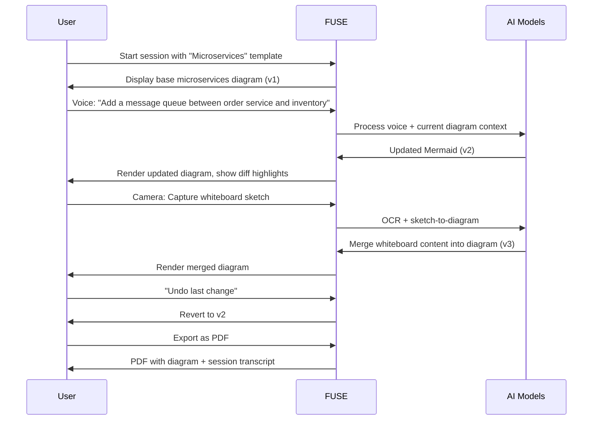

**Exit Criteria:**
- Five or more diagram types supported.
- At least 20 built-in templates across four or more categories.
- SVG, PNG, PDF, and PowerPoint export functional.
- Version history with visual diff for all diagram changes.
- Sketch-to-diagram conversion accuracy above 80% for common diagram types.

---

## 6. Phase 4: Enterprise Features (Q1-Q2 2027)

**Goal:** Make FUSE ready for enterprise adoption with security, compliance, and administration features.

### 6.1 SSO and Enterprise Authentication

| Task | Description | Priority |
|---|---|---|
| SAML 2.0 support | Integrate with enterprise identity providers (Okta, Azure AD, OneLogin). | P0 |
| SCIM provisioning | Automated user provisioning and deprovisioning from enterprise IdP. | P1 |
| Multi-factor authentication | Support TOTP and WebAuthn as second factors. | P0 |
| Domain-based auto-join | Users with verified corporate email domains auto-join the organization. | P1 |

### 6.2 Organization and Team Management

| Task | Description | Priority |
|---|---|---|
| Organization entity | Top-level container for enterprise customers with billing, settings, and member management. | P0 |
| Team hierarchy | Organizations contain teams; teams contain members. Rooms can be team-scoped. | P1 |
| Admin console | Web UI for organization admins to manage users, teams, settings, and billing. | P0 |
| Delegated administration | Team leads can manage their own team members and room permissions. | P2 |

### 6.3 Audit Logging

| Task | Description | Priority |
|---|---|---|
| Comprehensive audit trail | Log all user actions: login, room creation, diagram changes, exports, member changes. | P0 |
| Immutable audit log | Write-once storage (Cloud Storage with retention policies or BigQuery). | P0 |
| Audit log API | Allow enterprise customers to export audit logs to their SIEM. | P1 |
| Real-time audit streaming | Webhook or Pub/Sub integration for real-time security monitoring. | P2 |

### 6.4 Data Governance

| Task | Description | Priority |
|---|---|---|
| Data retention policies | Configurable per-organization: auto-delete sessions after N days. | P0 |
| Data residency | Option to specify data storage region (US, EU, APAC). | P1 |
| Data export (GDPR) | Users can request full export of their data. | P0 |
| Data deletion (GDPR) | Users can request complete deletion of their data. | P0 |
| Encryption at rest | Customer-managed encryption keys (CMEK) via Cloud KMS. | P1 |

### 6.5 Custom Model Configuration

| Task | Description | Priority |
|---|---|---|
| Model selection | Organizations can choose which Gemini models to use (cost vs. quality tradeoff). | P1 |
| Custom system prompts | Organizations can customize the AI's domain knowledge and output style. | P0 |
| Fine-tuned models | Support for organization-specific fine-tuned Gemini models (architecture standards, naming conventions). | P2 |
| Bring-your-own-model | Support for non-Gemini models (OpenAI, Anthropic) via adapter layer. | P2 |

### 6.6 On-Premises Deployment

| Task | Description | Priority |
|---|---|---|
| Helm chart | Kubernetes deployment for on-prem or private cloud. | P1 |
| Air-gapped support | Documentation and tooling for deployments without internet access (requires local model serving). | P2 |
| Configuration management | Terraform modules for GCP, AWS, and Azure deployments. | P1 |

### Enterprise Architecture

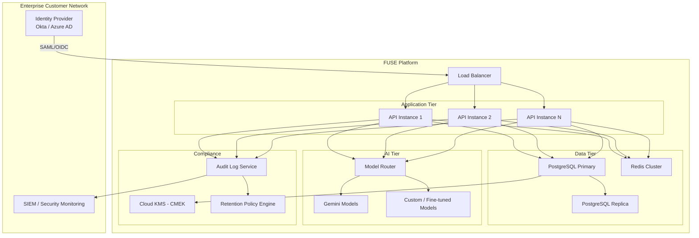

**Exit Criteria:**
- SAML SSO integration tested with at least two major IdPs.
- Audit logging captures all user actions with tamper-proof storage.
- GDPR data export and deletion functional.
- At least one enterprise pilot customer onboarded.
- Helm chart validated on GKE, EKS, and AKS.

---

## 7. Phase 5: Platform and Ecosystem (Q3-Q4 2027)

**Goal:** Transform FUSE from a product into a platform that third parties can extend and build upon.

### 7.1 Plugin System

| Task | Description | Priority |
|---|---|---|
| Plugin API specification | Define a versioned API for plugins to hook into FUSE events (diagram change, voice input, export). | P0 |
| Plugin runtime | Sandboxed execution environment for plugins (WebAssembly or container-based). | P0 |
| Plugin lifecycle management | Install, enable, disable, update, and uninstall plugins per organization. | P0 |
| Built-in plugin examples | Reference plugins: Jira ticket creation from diagram nodes, Slack notifications, GitHub issue sync. | P1 |

### 7.2 Public API

| Task | Description | Priority |
|---|---|---|
| REST API v1 | Full CRUD API for rooms, diagrams, templates, users, and organizations. | P0 |
| WebSocket API v1 | Documented protocol for real-time integration (bot users, automated inputs). | P0 |
| API documentation | OpenAPI 3.0 spec with interactive documentation (Swagger UI / Redoc). | P0 |
| Rate limiting tiers | Different API rate limits per pricing tier. | P0 |
| Webhooks | Event-driven notifications for room events, diagram changes, export completions. | P1 |

### 7.3 Template Marketplace

| Task | Description | Priority |
|---|---|---|
| Template publishing | Users and organizations can publish templates to the marketplace. | P1 |
| Template discovery | Search, filter by category/domain/rating, preview before use. | P1 |
| Revenue sharing | Template authors earn a share of paid template revenue. | P2 |
| Quality review | Review process for marketplace submissions (automated checks + manual review). | P1 |

### 7.4 SDK and Developer Tools

| Task | Description | Priority |
|---|---|---|
| Python SDK | Client library for the FUSE API with async support. | P0 |
| JavaScript/TypeScript SDK | Client library for web and Node.js integrations. | P0 |
| CLI tool | Command-line interface for scripting and automation (create rooms, export diagrams, manage templates). | P1 |
| Custom agent framework | SDK for building custom AI agents that participate in FUSE sessions (e.g., a security review agent, a cost estimation agent). | P1 |

### 7.5 Integrations

| Task | Description | Priority |
|---|---|---|
| Confluence | Embed live FUSE diagrams in Confluence pages. | P1 |
| Notion | FUSE diagram block for Notion. | P1 |
| GitHub / GitLab | Auto-update architecture diagrams in repository documentation on diagram change. | P1 |
| Slack / Teams | Bot for starting FUSE sessions from chat, sharing diagram snapshots. | P1 |
| Figma | Import Figma designs as context for architecture discussions. | P2 |

### Platform Architecture

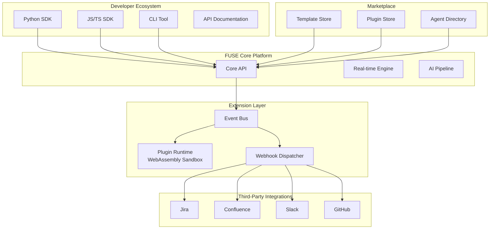

**Exit Criteria:**
- Public API with at least three third-party integrations live.
- Plugin system with sandbox security audit passed.
- Template marketplace with at least 50 community-contributed templates.
- SDKs published to PyPI and npm.
- At least 10 active third-party developers building on the platform.

---

## 8. Monetization Strategy

### 8.1 Pricing Tiers

| Tier | Price | Target | Includes |
|---|---|---|---|
| **Free** | $0/month | Individual users, evaluation | 3 rooms/month, 60 min voice/month, 5 exports/month, community templates only, single user per room |
| **Pro** | $25/user/month | Small teams, freelancers | Unlimited rooms, 600 min voice/month, unlimited exports (SVG/PNG/PDF), version history (30 days), up to 5 users per room |
| **Team** | $49/user/month (min 5 users) | Mid-size teams | Everything in Pro + PowerPoint export, 90-day history, 20 users per room, custom templates, priority support |
| **Enterprise** | Custom pricing | Large organizations | Everything in Team + SSO/SAML, audit logging, data residency, CMEK, custom models, on-prem option, SLA, dedicated support |

### 8.2 Revenue Model

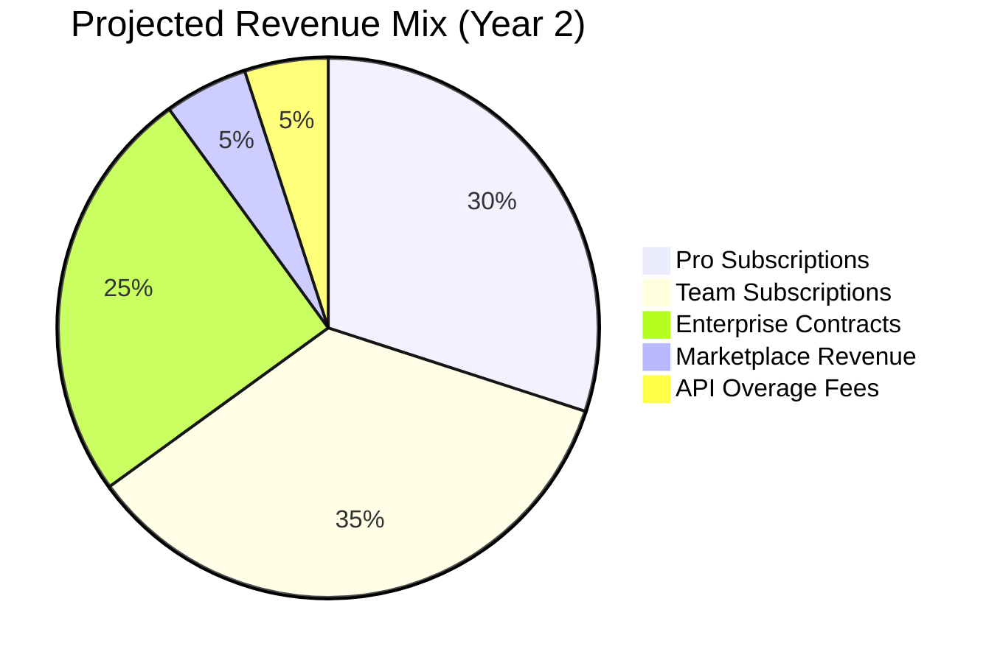

### 8.3 Unit Economics Targets

| Metric | Target |
|---|---|
| Customer Acquisition Cost (CAC) | Less than $150 for Pro, less than $500 for Team |
| Lifetime Value (LTV) | Greater than $600 for Pro, greater than $3,000 for Team |
| LTV:CAC Ratio | Greater than 3:1 |
| Monthly churn rate | Less than 5% for Pro, less than 3% for Team |
| Gross margin | Greater than 70% (accounting for Gemini API costs) |

### 8.4 Cost Management

The primary variable cost is Gemini API usage. Key strategies to manage this:

1. **Caching**: Cache frequently requested diagram validations and template expansions.
2. **Model tiering**: Use cheaper models (Flash Lite) where possible; reserve Pro for validation only.
3. **Usage quotas**: Enforce per-tier limits to prevent abuse and control costs.
4. **Batch processing**: Batch vision frames rather than processing every frame individually.
5. **Idle timeout**: Disconnect Gemini Live sessions after configurable idle period (default: 5 minutes).

---

## 9. Technical Debt and Infrastructure

### 9.1 Database Migration: Redis to Redis + PostgreSQL

**Current:** Redis serves as the sole data store (volatile, no durability guarantees).

**Target:** Dual-store architecture.

| Data Type | Store | Rationale |
|---|---|---|
| Active session state (diagram, audio buffers) | Redis | Low-latency, ephemeral, pub/sub for real-time |
| User profiles, rooms, memberships | PostgreSQL | Relational integrity, durable, queryable |
| Diagram version history | PostgreSQL (with JSON columns) | Durable, queryable, supports diffing |
| Audit logs | PostgreSQL or BigQuery | Immutable, durable, queryable |
| Export artifacts (PDFs, images) | Cloud Storage | Object storage, CDN-ready |
| Rate limiting counters | Redis | Low-latency, atomic operations |

**Migration Plan:**
1. Introduce PostgreSQL (Cloud SQL) alongside existing Redis.
2. Implement Alembic for schema migrations.
3. Migrate user/room data to PostgreSQL incrementally.
4. Redis remains for real-time state and pub/sub only.

### 9.2 CDN and Static Asset Delivery

| Task | Description |
|---|---|
| Cloud CDN | Front the application with Cloud CDN for static assets (JS, CSS, images). |
| Cache headers | Set appropriate Cache-Control headers for static vs. dynamic content. |
| Asset versioning | Hash-based filenames for cache busting on deployments. |
| Global distribution | CDN PoPs for low-latency access worldwide. |

### 9.3 Load Balancing and Horizontal Scaling

| Task | Description |
|---|---|
| Cloud Run auto-scaling | Configure min/max instances, concurrency limits, CPU/memory thresholds. |
| WebSocket-aware routing | Ensure load balancer supports WebSocket upgrade and session affinity. |
| Regional deployment | Deploy to multiple regions for latency and redundancy. |
| Database connection pooling | Use PgBouncer or Cloud SQL Proxy for efficient PostgreSQL connections. |

### 9.4 Horizontal Scaling Architecture

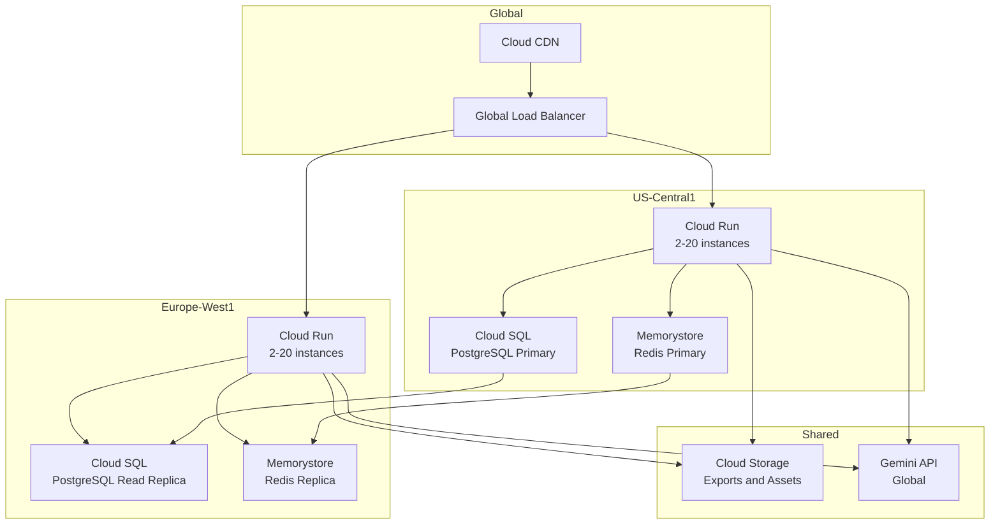

### 9.5 Infrastructure as Code

| Task | Description |
|---|---|
| Terraform modules | Define all GCP resources (Cloud Run, Cloud SQL, Memorystore, VPC, IAM) as Terraform. |
| Environment parity | Staging and production environments defined from the same Terraform modules with different variables. |
| Secret management | Use Google Secret Manager for all secrets; reference in Cloud Run via secret volumes. |
| Disaster recovery | Automated database backups, cross-region replication, documented recovery runbook. |

---

## 10. Success Metrics and KPIs

### 10.1 Product Metrics

| Metric | Phase 1 Target | Phase 2 Target | Phase 3 Target | Phase 5 Target |
|---|---|---|---|---|
| Monthly Active Users (MAU) | 100 | 1,000 | 10,000 | 100,000 |
| Sessions per user per week | 2 | 3 | 4 | 5 |
| Average session duration | 10 min | 15 min | 20 min | 25 min |
| Diagrams exported per session | 0.5 | 1.0 | 2.0 | 3.0 |
| User retention (30-day) | 20% | 35% | 50% | 60% |

### 10.2 Technical Metrics

| Metric | Target |
|---|---|
| API latency (P50) | Less than 200ms |
| API latency (P99) | Less than 2s |
| WebSocket message latency (P50) | Less than 100ms |
| Voice-to-diagram update latency | Less than 3s |
| Uptime (monthly) | 99.9% |
| Error rate | Less than 0.5% |
| Deployment frequency | Daily (automated) |
| Mean time to recovery (MTTR) | Less than 30 minutes |

### 10.3 Business Metrics

| Metric | Year 1 Target | Year 2 Target |
|---|---|---|
| Annual Recurring Revenue (ARR) | $250K | $2M |
| Paying customers | 200 | 1,500 |
| Enterprise contracts | 5 | 25 |
| Net Revenue Retention | 110% | 120% |
| Monthly burn rate | Less than $50K | Less than $100K |

### 10.4 AI Quality Metrics

| Metric | Target |
|---|---|
| Diagram accuracy (user-rated) | Greater than 4.0 / 5.0 |
| Vision OCR accuracy | Greater than 90% |
| Sketch-to-diagram fidelity | Greater than 80% |
| Validation true positive rate | Greater than 85% |
| Voice command recognition accuracy | Greater than 95% |

---

## 11. Risk Assessment

### 11.1 Risk Matrix

| Risk | Likelihood | Impact | Mitigation |
|---|---|---|---|
| **Gemini API cost escalation** | High | High | Model tiering, caching, usage quotas, negotiate volume discounts. Budget alerts at 80% of monthly target. |
| **Gemini API breaking changes** | Medium | High | Pin API versions, maintain adapter layer, automated integration tests against Gemini API. |
| **Gemini API availability** | Medium | High | Circuit breakers, graceful degradation, evaluate multi-provider strategy (Phase 4). |
| **WebSocket scalability limits** | Medium | Medium | Load test early, evaluate Cloud Run WebSocket limits, consider dedicated WebSocket infrastructure (e.g., Cloud Pub/Sub Lite) if needed. |
| **Low user adoption** | Medium | High | Validate with beta users before each phase. Invest in onboarding UX. Build sharing/virality into the product. |
| **Enterprise sales cycle length** | High | Medium | Start enterprise conversations in Phase 2. Build relationships during Phase 3. Have pilot-ready product by Phase 4 start. |
| **Competitor entry** | Medium | Medium | Move fast on differentiation (voice + vision). Build switching costs via templates, integrations, and collaboration history. |
| **Data privacy incident** | Low | Critical | Security audit every phase. Penetration testing. Bug bounty program. Encryption at rest and in transit. Incident response plan. |
| **Key person dependency** | Medium | Medium | Document all architecture decisions. Ensure no single-person ownership of critical systems. |
| **Technical debt accumulation** | High | Medium | Allocate 20% of engineering capacity to debt reduction every sprint. Track debt items in a visible backlog. |

### 11.2 Dependency Risks

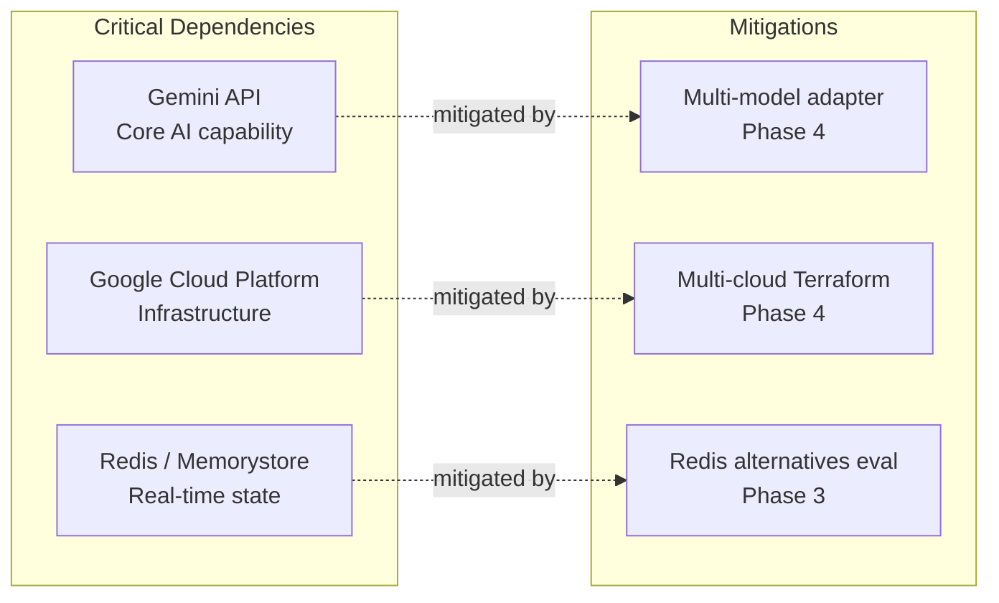

### 11.3 Go/No-Go Decision Points

Each phase has explicit go/no-go criteria before proceeding:

| Transition | Go Criteria | No-Go Action |
|---|---|---|
| Phase 1 to Phase 2 | 50+ active beta users, less than 1% error rate, CI/CD fully operational | Extend Phase 1, address quality gaps |
| Phase 2 to Phase 3 | 5+ concurrent users stable, 200+ MAU, positive NPS from beta | Extend Phase 2, fix collaboration reliability |
| Phase 3 to Phase 4 | 1,000+ MAU, 3+ enterprise prospects in pipeline, SOC 2 preparation started | Extend Phase 3, accelerate enterprise outreach |
| Phase 4 to Phase 5 | 1+ signed enterprise customer, 5,000+ MAU, stable unit economics | Extend Phase 4, focus on enterprise delivery |

---

## Appendix A: Technology Stack Summary

| Layer | Current | Target (Phase 5) |
|---|---|---|
| **Backend** | FastAPI (Python) | FastAPI (Python) + background workers (Celery or Cloud Tasks) |
| **Frontend** | Vanilla HTML/JS | React or Svelte SPA with TypeScript |
| **Real-time** | WebSocket (native) | WebSocket + Redis Pub/Sub fan-out |
| **AI Models** | Gemini (3 models, hardcoded) | Multi-model via adapter layer (Gemini, OpenAI, Anthropic) |
| **Primary Database** | Redis only | PostgreSQL (Cloud SQL) |
| **Cache / Real-time State** | Redis (Memorystore) | Redis Cluster (Memorystore) |
| **Object Storage** | None | Cloud Storage |
| **CDN** | None | Cloud CDN |
| **CI/CD** | None | GitHub Actions + Cloud Build |
| **IaC** | Manual console | Terraform |
| **Monitoring** | None | Cloud Monitoring + OpenTelemetry |
| **Auth** | None | OAuth 2.0 / OIDC + SAML (enterprise) |

## Appendix B: Estimated Engineering Effort

| Phase | Duration | Estimated Team Size | Total Person-Months |
|---|---|---|---|
| Phase 1: Production Hardening | 3 months | 2-3 engineers | 6-9 |
| Phase 2: Multi-User | 3 months | 3-4 engineers | 9-12 |
| Phase 3: Enhanced AI | 3 months | 4-5 engineers | 12-15 |
| Phase 4: Enterprise | 6 months | 5-7 engineers | 30-42 |
| Phase 5: Platform | 6 months | 6-8 engineers | 36-48 |
| **Total** | **21 months** | **Scaling 2 to 8** | **93-126** |

---

*This document is a living roadmap. It should be reviewed and updated quarterly as market conditions, user feedback, and technical constraints evolve.*
